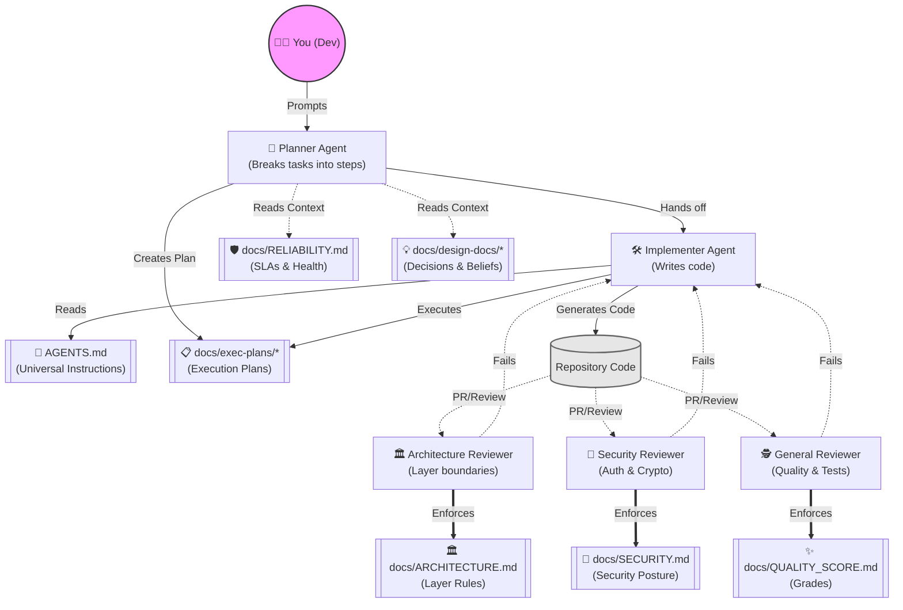

# 🧠 The Brain: Agent Knowledge Graph

This document provides a visual map of the AI agent infrastructure, specialized personas, and the repository's rules.

## 🕸️ Agent Architecture Graph

## 📂 Core Concepts

- **AGENTS.md**: The root of the agentic setup. All IDEs and CLIs look here first.
- **Planner Phase**: Agents analyze the task and architecture, producing a markdown execution plan.
- **Implementer Phase**: Agents write code strictly following the `ARCHITECTURE.md` boundary rules.
- **Review Phase**: Sub-agents verify code quality, structure, and security before humans approve.
- **Enforcement**: Run `npx harnesskit enforce` to mechanically validate layer rules.
